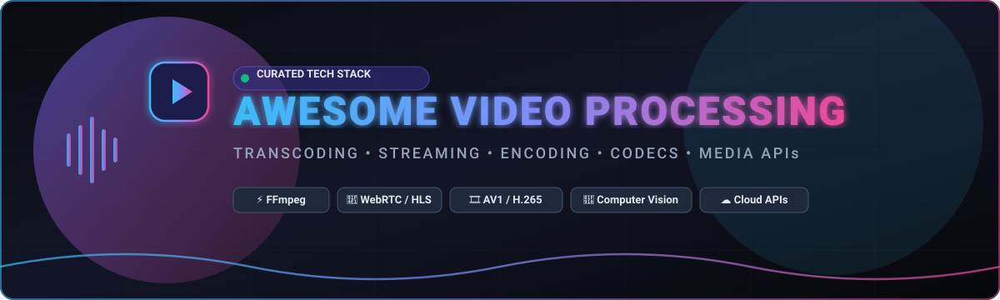

# 🎬 Awesome Video Processing 🚀

  
  
  
  
  

**A Curated Tech Index of Cloud Video APIs, SaaS Platforms, Open-Source Transcoding Engines, Codecs, Media Servers & Computer Vision Pipelines** 🎥✨

*Transcoding • Encoding • HLS/DASH Streaming • WebRTC • Video Editing • AI Media Pipelines • Hardware Acceleration • Media APIs*

---

## 📖 Overview & Ecosystem Guide

Welcome to the definitive guide and repository index for **Video Processing Engineering**. Whether you are building real-time live streaming infrastructure, automated programmatic video generation pipelines, AI video computer vision models, or cloud-scale transcoding workflows, this collection curates top-tier **commercial SaaS platforms** and battle-tested **open-source projects**.

### 🌟 Key Focus Areas
- 🔄 **Transcoding & Encoding:** Multi-codec support (AV1, H.265/HEVC, H.264, VP9, ProRes), hardware acceleration (NVENC, Quick Sync, VA-API, VideoToolbox).
- 📡 **Streaming Infrastructure:** Low-latency WebRTC, LL-HLS, MPEG-DASH, RTMP, RTSP, SRT ingestion, and edge CDN distribution.
- ✂️ **Programmatic Editing & Automation:** JSON-driven timeline composition, canvas/React video rendering, caption burning, dynamic watermarking, and audio normalization.
- 🤖 **Video AI & Computer Vision:** Object detection, scene classification, speech-to-text subtitling, perceptual quality scoring (VMAF, PSNR, SSIM).

---

## 📑 Table of Contents

- [☁️ SaaS / Hosted Video Processing Platforms](#️-saas--hosted-video-processing-platforms)
- [💻 Open-Source GitHub Projects (Ranked by Stars ⭐)](#-open-source-github-projects-ranked-by-stars-)
- [🏗️ Recommended Architecture Combinations](#️-recommended-architecture-combinations)
- [🧩 Video Processing Building Blocks](#-video-processing-building-blocks)
- [💡 Core Video Concepts & Codecs](#-core-video-concepts--codecs)
- [📈 Star History](#-star-history)
- [🤝 How to Contribute](#-how-to-contribute)
- [📜 Disclaimer](#-disclaimer)

---

## ☁️ SaaS / Hosted Video Processing Platforms

*Ranked in descending order of company scale (Valuation / Market Cap / Revenue).*

| Platform | Description | Company Scale (Valuation / ARR) | Starting Pricing | Free Tier / Trial Limits |
| :--- | :--- | :--- | :--- | :--- |
| **[Cloudflare Images & Stream](https://www.cloudflare.com/developer-platform/products/cloudflare-images/)** | Cloudflare's global edge infrastructure for image & video transformation, adaptive streaming, storage, and low-latency CDN delivery. | **~$112.4B Market Cap** (NYSE: NET) / ~$2.5B+ ARR | **Stream:** Starts at $5.00/mo (1,000 storage mins; $1.00/1k delivery mins). **Images:** $5.00/mo (100k stored images + $1.00/100k delivered) | **Images:** 5,000 free unique transformations/mo. **Stream:** 100 free stored mins and 10,000 free delivery mins/mo on Pro/Business plans |
| **[Cloudinary](https://cloudinary.com/)** | Enterprise cloud media platform offering automated transcoding, smart cropping, AI visual analysis, multi-CDN delivery, and dynamic transformations. | **~$2.0B Valuation** (Bootstrapped Unicorn) / ~$100M ARR | **Plus Plan:** $99/mo ($89/mo billed annually) with 225 monthly credits included | **Free Forever Plan:** 25 monthly credits (~25,000 transformations, 25 GB storage, or 25 GB net bandwidth), up to 3 user seats |
| **[Mux](https://www.mux.com/)** | Developer-first video infrastructure platform powering video ingestion, automated multi-bitrate encoding, live streaming, and real-time playback analytics. | **~$1.0B Valuation** (Series D Unicorn) / ~$46.1M ARR | **Pay-As-You-Go ($0 base fee):** $0.05/min input encoding ($0/min for Basic quality), $0.003/min storage/mo, $0.0012/min streamed delivery | **Free Forever Plan:** Up to 10 stored video assets and 100,000 delivery minutes/month (live streaming excluded) |
| **[Brightcove (Zencoder)](https://zencoder.com/)** | Industry-standard cloud encoding and media delivery engine for high-volume automated transcoding, format conversions, and OTT workflows. | **~$404.7M Market Cap** (NASDAQ: BCOV) / ~$200M Revenue | **Pay-As-You-Go:** $0.05 per output minute ($0.02/min on volume monthly subscription plans) | **Integration Test Mode (Free Forever):** Unlimited free test jobs with output video duration capped at 5 seconds per job |
| **[Imgix](https://www.imgix.com/)** | High-performance real-time URL-based media transformation, visual optimization, dynamic rendering, and CDN caching platform. | **~$100M Valuation** (Venture-backed) / ~$10.4M ARR | **Starter Plan:** $25/mo (includes 100 credits; Basic plan at $75/mo for 375 credits) | **30-Day Free Trial:** 100 free credits to evaluate platform features (no credit card required; no permanent free plan) |
| **[Banuba](https://www.banuba.com/)** | Video and AR technology platform offering specialized client SDKs for mobile video editing, AR face filters, background subtraction, and UGC tools. | **~$60M - $80M Valuation** (Profitable) / ~$9.8M ARR | **Custom Pricing (Quote-based):** Tiered based on Monthly Active Users (MAU) per platform (iOS, Android, Flutter, React Native; contact sales for quote) | **14-Day Free Trial:** Full SDK feature access and platform evaluation token across all supported platforms for 14 days |
| **[Filestack](https://www.filestack.com/)** | Media upload, transformation, file ingestion, OCR, virus scanning, and asset management API suite for web and mobile apps. | **~$40M - $50M Valuation** (Parent: Idera $1B+) / ~$15M ARR | **Start Plan:** $69/mo (includes 50,000 uploads, 25,000 transformations, 50 GB bandwidth, 100 GB storage) | **Free Forever Plan:** 500 uploads/month, 1,000 transformations/month, 1.0 GB bandwidth/month, 1.0 GB storage, 1 user seat |
| **[api.video](https://api.video/)** | End-to-end video API service for instant video upload, 4K encoding, live streaming, hosted video player, and global edge delivery. | **~$25M - $30M Valuation** (Series A) / ~$3M - $5M ARR | **Pay-As-You-Go ($0 base fee):** $0.00/min encoding (free unlimited), hosting from $0.00285/min stored/mo, delivery from $0.0017/min delivered | **Developer Sandbox (Free Forever):** Full API testing access, videos capped at 30 seconds max length, watermarked, 24-hour expiration |
| **[Shotstack](https://shotstack.io/)** | Cloud video automation API utilizing declarative JSON timeline manifests to programmatically render, composite, and generate video at scale. | **~$15M - $20M Valuation** (Seed stage) / ~$770K ARR | **Starter Plan:** $39/mo (includes 200 render minutes / credits; PAYG available at ~$0.30/min with $75 min commitment) | **30-Day Free Trial / Sandbox:** 10 free credits valid for 30 days (test renders include watermark; no permanent production free plan) |
| **[Transloadit](https://transloadit.com/)** | Automation serverless pipeline service for video encoding, resizing, watermarking, audio extraction, and cloud storage replication. | **~$10M - $15M Valuation** (Bootstrapped profitable) / ~$1.3M ARR | **Community / Starter Tier:** $9/mo (includes 50 GB processing data + $0.18/GB overage) | **Community Plan (Free Forever):** 5 GB processing data per month (trial outputs subject to watermarking/trimming) |

---

## 💻 Open-Source GitHub Projects (Ranked by Stars ⭐)

*All repositories are ranked in descending order based on their GitHub star counts.*

1. **[yt-dlp](https://github.com/yt-dlp/yt-dlp)**   
   ⚡ Feature-rich command-line video and audio downloader supporting hundreds of media sites with advanced extraction and post-processing capabilities.

2. **[OpenCV](https://github.com/opencv/opencv)**   
   👁️ Open Source Computer Vision and Machine Learning software library with thousands of optimized algorithms for real-time video analysis, object tracking, and image processing.

3. **[OBS Studio](https://github.com/obsproject/obs-studio)**   
   🎥 Free and open-source software for live video recording, audio mixing, scene composition, and high-performance live broadcasting.

4. **[FFmpeg](https://github.com/FFmpeg/FFmpeg)**   
   🎞️ The ubiquitous industry-standard multimedia framework capable of decoding, encoding, transcoding, muxing, demuxing, streaming, filtering, and playing almost anything ever created.

5. **[Remotion](https://github.com/remotion-dev/remotion)**   
   ⚛️ Create programmatic videos and animations using React, web technologies, and automated server-side rendering pipelines.

6. **[Jellyfin](https://github.com/jellyfin/jellyfin)**   
   🍿 The Free Software Media System that puts you in control of managing, transcoding on the fly, and streaming your media collection across devices.

7. **[Video.js](https://github.com/videojs/video.js)**   
   🌐 Open-source HTML5 video player framework with support for adaptive streaming (HLS/DASH), plugins, skinning, and cross-browser consistency.

8. **[Plyr](https://github.com/sampotts/plyr)**   
   ✨ A simple, lightweight, accessible, and customizable HTML5, YouTube, and Vimeo media player with full adaptive streaming integration.

9. **[SRS (Simple Realtime Server)](https://github.com/ossrs/srs)**   
   🚀 High-performance, production-ready video server supporting RTMP, WebRTC, HLS, HTTP-FLV, SRT, and ultra-low-latency live streaming.

10. **[HandBrake](https://github.com/HandBrake/HandBrake)**   
    🗜️ Open-source video transcoder for converting video from nearly any format to a selection of modern, widely supported codecs with optimized presets.

11. **[LiveKit](https://github.com/livekit/livekit)**   
    🎙️ End-to-end WebRTC stack and infrastructure for real-time video conferencing, live streaming, voice AI agents, and interactive multi-party media.

12. **[MediaMTX](https://github.com/bluenviron/mediamtx)**   
    📡 Zero-dependency real-time media server and proxy that routes, converts, and republishes RTSP, RTMP, HLS, WebRTC, and SRT video streams.

13. **[hls.js](https://github.com/video-dev/hls.js)**   
    📶 JavaScript library that implements an HTTP Live Streaming (HLS) client relying on HTML5 video and MediaSource Extensions (MSE).

14. **[ffmpeg-python](https://github.com/kkroening/ffmpeg-python)**   
    🐍 Python bindings for FFmpeg with complex filter-graph support, fluent piping, and granular encoding options.

15. **[Janus Gateway](https://github.com/meetecho/janus-gateway)**   
    🛡️ General-purpose WebRTC server and media gateway designed to set up WebRTC media communications with server-side processing plugins.

16. **[fluent-ffmpeg](https://github.com/fluent-ffmpeg/node-fluent-ffmpeg)**   
    🟢 Comprehensive Node.js module that provides a fluent, chainable API for executing FFmpeg transcoding tasks.

17. **[GStreamer](https://github.com/GStreamer/gstreamer)**   
    🧩 Extremely powerful, modular pipeline-based multimedia framework used to build arbitrary media processing workflows from source to sink.

18. **[Shaka Player](https://github.com/shaka-project/shaka-player)**   
    🛡️ Google's open-source JavaScript player library for adaptive media (DASH & HLS) with integrated DRM systems (Widevine, PlayReady, FairPlay).

19. **[Shotcut](https://github.com/shotcut/shotcut)**   
    🎬 Cross-platform non-linear video editor supporting hundreds of audio/video formats, 4K resolutions, timeline editing, and GPU-accelerated effects.

20. **[OpenH264](https://github.com/cisco/openh264)**   
    🔐 Cisco's open-source H.264 / AVC codec implementation supporting real-time video communications and WebRTC encoding/decoding.

21. **[OvenMediaEngine](https://github.com/AirenSoft/OvenMediaEngine)**   
    ⚡ Ultra-low-latency streaming server capable of broadcasting sub-second latency video via WebRTC, Low Latency HLS (LL-HLS), and RTMP.

22. **[rav1e](https://github.com/xiph/rav1e)**   
    🦀 Ultra-fast, memory-safe AV1 video encoder written in Rust, designed to provide high encoding density and superior compression efficiency.

23. **[OpenShot](https://github.com/OpenShot/openshot-qt)**   
    ✂️ Award-winning, easy-to-use open-source video editor built on C++ and Python, featuring 3D animated titles, curve-based keyframe animations, and audio waveforms.

24. **[dash.js](https://github.com/Dash-Industry-Forum/dash.js)**   
    📊 The official reference client implementation of the MPEG-DASH standard by the DASH Industry Forum for playback of adaptive bitrate video streams.

25. **[Ant Media Server](https://github.com/ant-media/Ant-Media-Server)**   
    📡 Scalable, ultra-low-latency WebRTC and adaptive streaming server supporting auto-scaling on Kubernetes, CMAF, and RTMP ingestion.

26. **[Shaka Packager](https://github.com/shaka-project/shaka-packager)**   
    📦 Media packaging framework by Google for VOD and Live DASH and HLS packaging, encryption (DRM), segmenting, and multi-track audio muxing.

27. **[GPAC / MP4Box](https://github.com/gpac/gpac)**   
    🧰 Open-source multimedia framework with MP4Box for MP4 multiplexing, DASH/HLS segmenting, media inspection, subtitle packaging, and SVG compositing.

28. **[MLT Framework](https://github.com/mltframework/mlt)**   
    🎛️ Modular open-source multimedia framework designed for television broadcasting, non-linear video editing, clip compositing, and transition rendering.

29. **[OrkasVideoStudio](https://github.com/Orkas-AI/Orkas-VideoStudio)**   
    🤖 MIT-licensed TypeScript CLI and MCP toolkit for editable JSON timelines, reusable video skills, and automatic assembly.

---

## 🏗️ Recommended Architecture Combinations

Below are battle-tested open-source architectural patterns for specific video engineering workloads:

### 1. 🔄 Scalable On-Demand Transcoding Service
- **Components:** `FastAPI / Go` + `FFmpeg (with NVENC GPU)` + `Celery / Redis / Kafka` + `MinIO / S3` + `PostgreSQL`
- **Use Case:** Asynchronous video ingestion, multi-bitrate HLS/DASH packaging, thumbnail extraction, and webhook status notification.

### 2. ⚡ Ultra-Low-Latency WebRTC & Live Broadcasting
- **Components:** `MediaMTX / SRS / OvenMediaEngine` + `WebRTC / WHEP / WHIP` + `LL-HLS` + `OBS Studio`
- **Use Case:** Interactive live streaming, surveillance camera RTSP-to-WebRTC conversion, webinar platforms, and auction broadcasts.

### 3. 🎨 Programmatic Video Generation at Scale
- **Components:** `Remotion` + `Node.js / Chromium SSR` + `FFmpeg` + `AWS Lambda / Kubernetes`
- **Use Case:** Generating personalized dynamic marketing clips, automated social media reels, sports highlight montages, and dynamic data-driven charts.

### 4. 🧠 AI Video Analytics & Intelligence Pipeline
- **Components:** `OpenCV` + `FFmpeg / PyAV` + `Ultralytics (YOLO)` + `OpenAI Whisper` + `Triton Inference Server`
- **Use Case:** Real-time object detection, automated subtitle & caption generation, content moderation, scene boundary detection, and OCR extraction.

---

## 🧩 Video Processing Building Blocks

### 📥 1. Video Ingestion & Protocols
- **File Uploads:** Resumable Upload (tus protocol), Multipart S3 Upload, Direct-to-Storage presigned URLs.
- **Live Streams:** RTMP, RTSP, SRT (Secure Reliable Transport), WebRTC (WHIP/WHEP), Zixi, RIST.

### ⚙️ 2. Transcoding & Transformation Operations
- **Spatial:** Scaling, Resizing, Smart Cropping (letterboxing / pan-and-scan), Rotation, Aspect Ratio Conversion.
- **Temporal:** Trimming, Slicing, Speed adjustment (Slow-Motion, Time-Lapse), Frame Rate Interpolation.
- **Compositing:** Watermarking, Dynamic Overlays, Subtitle Burning (SRT/ASS/VTT), Picture-in-Picture (PiP), Chroma Keying.
- **Audio:** Normalization (EBU R128 / LUFS), Audio Track Replacement, Multi-lingual Track Muxing, Noise Reduction.

### 📦 3. Packaging, DRM & Delivery
- **Adaptive Bitrate (ABR):** HLS (`.m3u8`), MPEG-DASH (`.mpd`), Low-Latency HLS (LL-HLS), CMAF (Common Media Application Format).
- **Protection & DRM:** Widevine, FairPlay, PlayReady, ClearKey AES-128 encryption.

---

## 💡 Core Video Concepts & Codecs

| Category | Formats & Standards | Primary Usage |
| :--- | :--- | :--- |
| **Video Codecs** | **AV1, H.265/HEVC, H.264/AVC, VP9, ProRes, DNxHD** | Compression efficiency, broadcast master delivery, streaming compatibility |
| **Audio Codecs** | **AAC, Opus, FLAC, AC-3, E-AC-3, MP3** | High-fidelity audio, ultra-low-latency real-time voice, surround sound |
| **Containers** | **MP4, WebM, MKV, MOV, MPEG-TS, Fragmented MP4 (fMP4)** | Multiplexed audio/video stream encapsulation and metadata tagging |
| **Quality Metrics** | **VMAF (Netflix), PSNR, SSIM, MS-SSIM** | Objective evaluation of perceptual video quality versus compression ratio |
| **Hardware Encoders** | **NVIDIA NVENC/NVDEC, Intel Quick Sync (QSV), Apple VideoToolbox, VA-API** | Dedicated silicon for ultra-fast, power-efficient encoding & decoding |

---

## 📈 Star History

---

## 🤝 How to Contribute

Contributions to expand this repository are warmly welcomed! Please follow these guidelines:
1. 🍴 **Fork the repository** on GitHub.
2. 📝 **Add or update entries** in [README.md](README.md) following the established table/list formatting.
3. ⭐ **Ensure factual accuracy:** Include official links, GitHub repository URLs with star badges, and precise pricing/free-tier limits for commercial tools.
4. 🔍 **Verify open-source licenses** before submitting new open-source software.
5. 🚀 **Submit a Pull Request (PR)** with a concise summary of your changes.

---

## 📜 Disclaimer

*This repository is a community-curated technological index for video engineers, developers, and media architects. Product names, logos, and brands are property of their respective owners. Information regarding pricing, features, and metrics is subject to change by respective vendors.*

  Maintained with ❤️ by <a href="https://github.com/ishandutta2007">Ishan Dutta</a> and the global open-source media engineering community.

